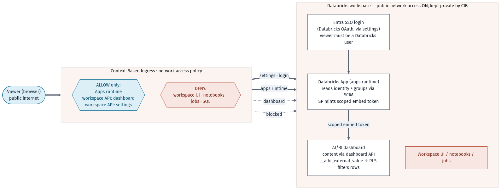

# Public App, Private Workspace: Secure Dashboard Embedding with Context-Based Ingress and RLS

This folder accompanies the blog post **"Public App, Private Workspace: securely embedding
Databricks AI/BI dashboards with context-based ingress and row-level security."**

> Blog post: _link to be added once published._

It shows how to make a Databricks App (with an embedded AI/BI dashboard) reachable by
external users over the public internet, while the Databricks workspace behind it stays
private, and how each viewer is shown **only their own rows** through row-level security
(RLS) driven by their Databricks group membership.

## The problem

A Databricks App is a workspace entity, served from the workspace's own domain. To expose
it publicly you must enable public network access at the cloud network layer, which sounds
like it opens the whole workspace. It does not have to: a **context-based ingress (CIB)**
network access policy lets you open only the access contexts the app needs and keep
everything else private. Separately, an **external embed token** lets the dashboard render
for a viewer without granting that viewer access to the underlying tables, and **RLS**
filters the rows each viewer sees.

## Flow



1. **Context-based ingress** allows only three contexts publicly: **Apps runtime**,
   workspace API **`dashboard`**, and workspace API **`settings`**. Workspace UI, notebooks,
   jobs and SQL stay private. `settings` is the one people miss - it is what lets the
   Databricks OAuth / SSO login complete; without it the embedded dashboard fails at login.
2. Because this is a **Databricks App**, the viewer signs in through the workspace's
   identity provider (e.g. Entra ID SSO) and must be a provisioned Databricks user. That
   authenticated identity is how the app knows their groups. (A truly login-less external
   viewer would require hosting the app outside Databricks.)
3. The app backend mints a **scoped embed token** (3-step OAuth, the service-principal
   secret never reaches the browser), so the viewer needs **no** dashboard or table grants.
4. The token carries `external_value`, which the dashboard's dataset SQL reads back as the
   global variable `__aibi_external_value` to **filter rows**.

## How RLS links to the embed

One scope value is resolved once, server-side, and enforced in the query:

| Viewer's groups | Resolved `external_value` | Dashboard shows |
|---|---|---|
| `airport-fra` | `FRA` | FRA rows only |
| `airport-fra` + `airport-bsb` | `FRA,BSB` | FRA and BSB rows |
| `airport-admin` | `` (empty) | all rows |
| a mapped legacy group (see `airports.json`) | e.g. `FRA` | FRA rows only |
| no airport group | `__no_access__` | no rows (fail-closed) |

The dataset SQL:

```sql
WHERE nullif(__aibi_external_value, '') is null                          -- admin -> all rows
   or array_contains(split(__aibi_external_value, ','), upper(airport))  -- "FRA" / "FRA,BSB"
```

Because the value is resolved from the authenticated identity and signed into the token,
the viewer never sees or sets it - one dashboard definition serves every viewer their own
slice, with no per-viewer copies.

## Contents

```
app/                         Minimal Python (FastAPI) app: embeds a published dashboard in an iframe
  app.py                       the app
  app.yaml                     Databricks Apps manifest (set WORKSPACE_HOST + DASHBOARD_ID)
  requirements.txt
server/                      The external-token + RLS building blocks (Node.js, no framework)
  embed.js                     3-step OAuth exchange that mints a scoped embed token
  rls.js                       resolves external_value from the viewer's Databricks groups
  airports.json                group -> airport config (prefix, admin groups, legacy overrides)
sql/
  rls-datasets.sql             the __aibi_external_value dataset filter pattern
images/
  external-embedding-cib-flow.png
```

`app/` is the simplest path (an iframe pointing at `/embed/dashboardsv3/<id>`), useful for a
first end-to-end test where viewers already have workspace access. `server/` is the
production pattern: `resolveExternalValue()` (in `rls.js`) computes the per-viewer scope and
`mintEmbedToken()` (in `embed.js`) mints the scoped token. Wire them together in your app's
embed-token route:

```js
import { resolveExternalValue } from './server/rls.js';
import { mintEmbedToken } from './server/embed.js';

app.post('/api/embed/token', async (req, res) => {
  const { value } = await resolveExternalValue(req, req.body?.externalValue);
  const token = await mintEmbedToken({
    dashboardId: process.env.DASHBOARD_ID,
    externalViewerId: /* a stable, non-PII id */ 'viewer',
    externalValue: value,
  });
  res.json({ token });
});
```

## Prerequisites

- A Databricks workspace and account **admin** rights to create a network access policy
  (context-based ingress lives at the account level).
- A published **AI/BI dashboard** whose dataset SQL uses `__aibi_external_value` (see `sql/`).
- A **Databricks App** whose service principal has **CAN RUN** on the dashboard (and `SELECT`
  on the underlying tables if the dashboard uses per-viewer data permissions). The app must
  declare the `dashboards` and `settings` OAuth scopes.
- The app domain added to the dashboard's **embedding approved-domains** list.
- **Account-level** Databricks groups for scoping (e.g. `airport-<code>`, plus an admin group).

## Setup

1. **Publish the dashboard** and set each dataset's SQL to the RLS pattern in `sql/`.
2. **Deploy the app** (`app/` for the iframe demo, or your own app using `server/`).
3. **Enable public network access** on the workspace at the cloud network layer.
4. **Create a context-based ingress policy** allowing only Apps runtime + workspace API
   `dashboard` + `settings`; create it in dry-run, then enforce, then attach it to the
   workspace.
5. **Add the app domain** to the dashboard's embedding approved-domains.
6. **Test** from an off-network browser: the app + dashboard load; the workspace UI does not.
   You can watch allowed/denied requests in `system.access.inbound_network`.

## Configuration (RLS)

`server/airports.json` and these env vars control scoping (env overrides the file per deploy):

| Setting | Purpose |
|---|---|
| `AIRPORT_GROUP_PREFIX` (default `airport-`) | a group `airport-fra` grants `FRA` |
| `ADMIN_GROUPS` (default `airport-admin`) | members see all rows |
| `GROUP_AIRPORT_MAP` (e.g. `legacy-fra-ops:FRA`) | map non-convention / legacy group names to a code |
| `ALLOW_CLIENT_AIRPORT` | **test only** - honor a client-supplied scope; must be false in prod |
| `FAIL_OPEN` | demo only - show all rows to unscoped viewers instead of failing closed |

## Security notes

- The scope is resolved from the runtime-injected `x-forwarded-email` (unforgeable) and the
  viewer's account groups - never from a client request path. Keep `ALLOW_CLIENT_AIRPORT`
  and `FAIL_OPEN` **off** in production.
- Unscoped viewers **fail closed** (`__no_access__` -> zero rows), never all rows.
- The service-principal secret stays server-side; only the short-lived scoped token reaches
  the browser.

## Licenses

- This example code is provided under the repository's Databricks license (see the repo root).
- Third-party dependencies and their licenses:
  - [FastAPI](https://github.com/tiangolo/fastapi) - MIT
  - [Uvicorn](https://github.com/encode/uvicorn) - BSD-3-Clause
  - [`@databricks/aibi-client`](https://www.npmjs.com/package/@databricks/aibi-client) - Databricks (AI/BI embedding SDK), loaded client-side per Databricks' embedding docs
  - The `server/` modules use only the Node.js standard library.

_No datasets, secrets, PII, or customer identifiers are included; workspace hosts, dashboard
ids, and catalog names are placeholders._
